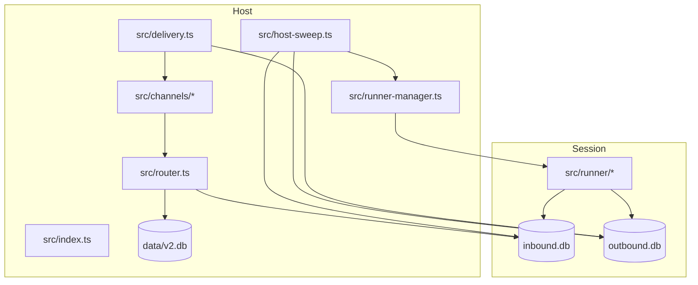

# Architecture

## Components

## Central DB

`data/v2.db` stores durable host-level state:

- users and roles
- agent groups
- messaging groups
- channel-to-agent wirings
- sessions
- agent configs
- pending questions and approvals

## Session DBs

Every session has:

- `inbound.db`: host writes, runner reads.
- `outbound.db`: runner writes, host reads.

The split avoids write contention and makes recovery explicit. The host never
needs a live process handle to know whether a message was claimed or completed.

## Runner Lifecycle

1. Router writes a pending message to `inbound.db`.
2. Host sweep sees due work and asks `runner-manager` to wake a runner.
3. Runner composes `groups/<folder>/AGENTS.md`.
4. Runner claims pending messages in `processing_ack`.
5. Runner calls the configured provider.
6. Runner writes one outbound chat reply.
7. Runner marks messages completed or failed and exits.

## Security Model

AnotherClaw is host-native. There is no per-agent isolation layer. Agent groups are
coordination boundaries for routing, memory, and configuration, not security
boundaries. Run AnotherClaw only on a host you intend the agent to control.
