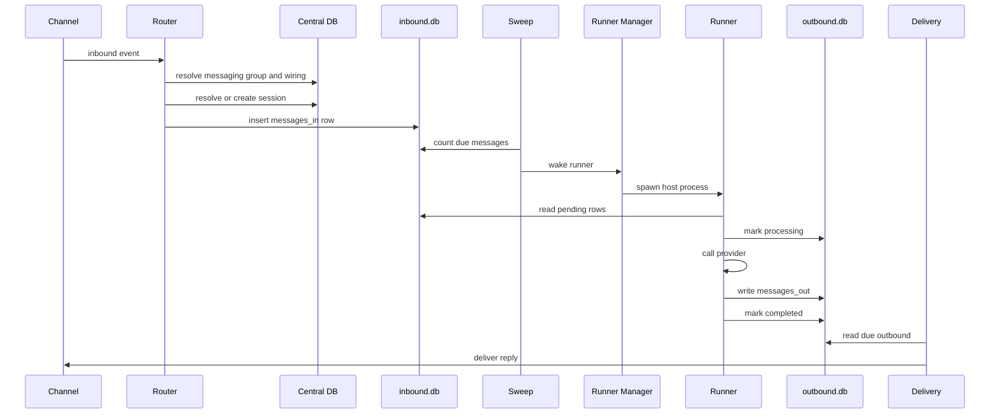

# Data Flow

## Inbound Message

## Failure And Retry

- If a runner exits before marking a message completed, `processing_ack` remains
  in `processing`.
- `host-sweep` compares claim age and heartbeat age.
- Stuck claims are reset with backoff until `MAX_TRIES`.
- Failed outbound delivery is tracked in `inbound.db.delivered` so retries do
  not duplicate successful messages.

## Sequence Numbers

- Host-written inbound rows use even `seq` values.
- Runner-written outbound rows use odd `seq` values.
- This keeps message references stable across the two DB files.
