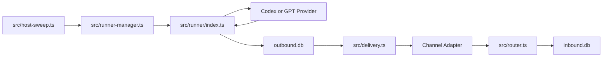

# AnotherClaw Wiki

## Pages

- [Architecture](architecture.md)
- [File Map](file-map.md)
- [Function Reference](functions.md)
- [Data Flow](data-flow.md)
- [Operations](operations.md)

## Design Summary

AnotherClaw is a single Node host plus short-lived host-native runner processes.
The host owns channel adapters, routing, central state, delivery, approvals, and
sweep/retry logic. A runner owns one session turn: it reads pending inbound
messages, calls the selected provider, writes outbound replies, and exits.



## Provider Boundary

The provider boundary is intentionally small:

```ts
export interface AgentProvider {
  name: string;
  run(input: ProviderInput): Promise<string>;
}
```

Current providers:

- `codex`: shells out to `codex exec`.
- `gpt`: calls OpenAI `/v1/responses` with `OPENAI_API_KEY`.

Future providers should register the same interface without changing router,
delivery, session DB, or channel code.
